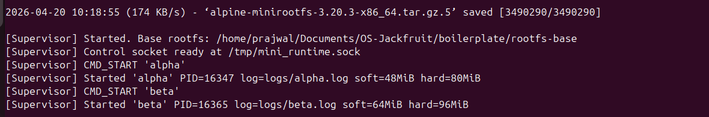
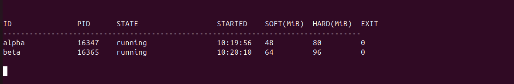
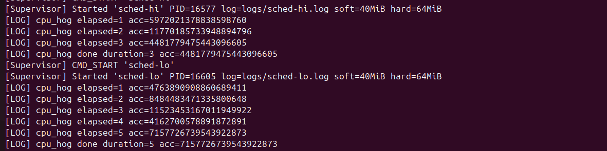
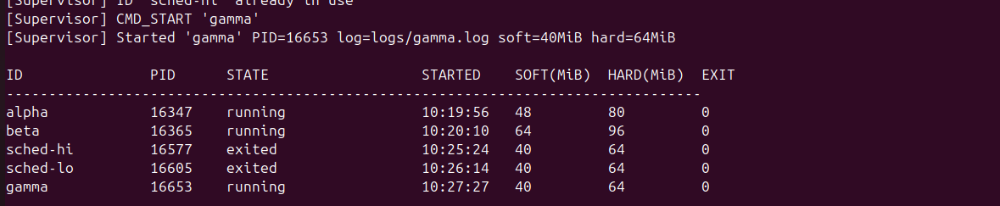
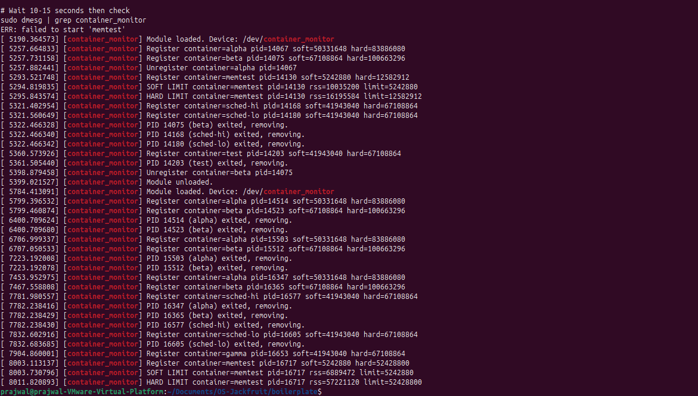
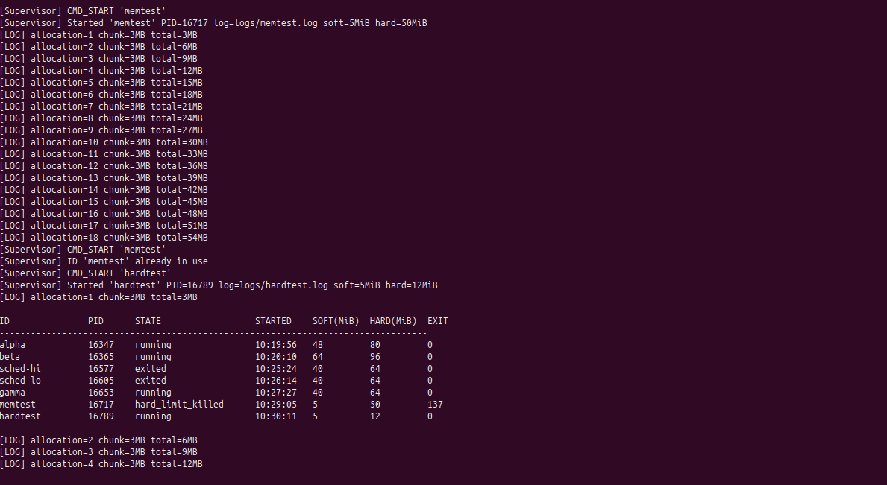
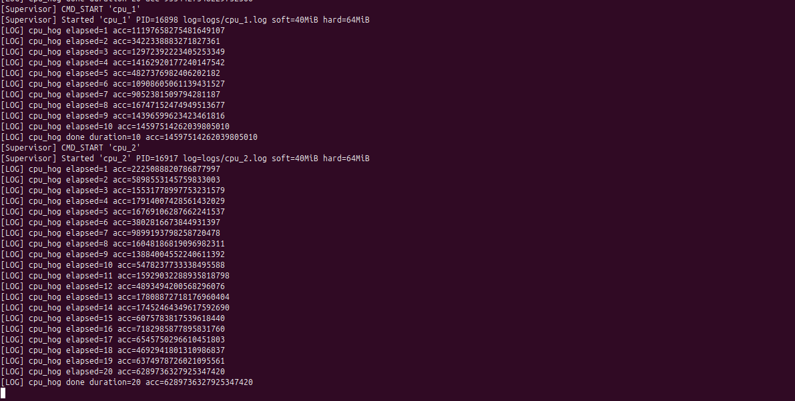
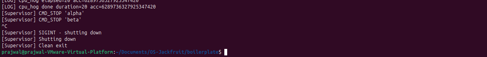
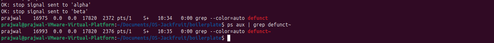

# Multi-Container Runtime with Kernel Memory Monitor

## Team Information

| Name | SRN |
|---|---|
| Prajwal G | PES1UG24CS590 |
| Nikhil P | PES1UG24CS583 |

---

## Build, Load, and Run Instructions

### Prerequisites

Ubuntu 22.04 or 24.04 VM with Secure Boot OFF. No WSL.

```bash
sudo apt update
sudo apt install -y build-essential linux-headers-$(uname -r)
```

### 1. Build

```bash
make -C boilerplate
```

This produces:
- `boilerplate/engine` — user-space supervisor binary
- `boilerplate/monitor.ko` — kernel module
- `boilerplate/cpu_hog`, `boilerplate/memory_hog`, `boilerplate/io_pulse` — statically linked workload binaries

### 2. Prepare Root Filesystem

> **Note:** On aarch64 systems use the `aarch64` tarball instead of `x86_64`.

```bash
mkdir -p rootfs-base
# x86_64:
wget https://dl-cdn.alpinelinux.org/alpine/v3.20/releases/x86_64/alpine-minirootfs-3.20.3-x86_64.tar.gz
tar -xzf alpine-minirootfs-3.20.3-x86_64.tar.gz -C rootfs-base

# Copy workload binaries into base rootfs
cp boilerplate/cpu_hog    rootfs-base/
cp boilerplate/memory_hog rootfs-base/
cp boilerplate/io_pulse   rootfs-base/

# Create one writable copy per container
cp -a rootfs-base rootfs-alpha
cp -a rootfs-base rootfs-beta
```

### 3. Load Kernel Module

```bash
sudo insmod boilerplate/monitor.ko
ls -l /dev/container_monitor
dmesg | tail -n 5
```

### 4. Start Supervisor (Terminal 1)

```bash
sudo ./boilerplate/engine supervisor ./rootfs-base
```

### 5. Use the CLI (Terminal 2)

```bash
# Start two containers
sudo ./boilerplate/engine start alpha ./rootfs-alpha "/cpu_hog 30"
sudo ./boilerplate/engine start beta  ./rootfs-beta  "/cpu_hog 30"

# List all containers
sudo ./boilerplate/engine ps

# View logs
sudo ./boilerplate/engine logs alpha

# Run foreground container (blocks until exit)
cp -a rootfs-base rootfs-gamma
sudo ./boilerplate/engine run gamma ./rootfs-gamma "/cpu_hog 5"

# Memory limit test
cp -a rootfs-base rootfs-mem1
sudo ./boilerplate/engine run mem1 ./rootfs-mem1 "/memory_hog 4 1000" --soft-mib 8 --hard-mib 24

# Scheduler experiment
cp -a rootfs-base rootfs-cpu1
cp -a rootfs-base rootfs-cpu2
sudo ./boilerplate/engine start cpu1 ./rootfs-cpu1 "/cpu_hog 15" --nice 0
sudo ./boilerplate/engine start cpu2 ./rootfs-cpu2 "/cpu_hog 15" --nice 10

# Stop containers
sudo ./boilerplate/engine stop alpha
sudo ./boilerplate/engine stop beta
```

### 6. Inspect Kernel Logs

```bash
dmesg | grep container_monitor
```

### 7. Unload Module and Clean Up

```bash
sudo rmmod monitor
make -C boilerplate clean
```

### Automated Test

A full end-to-end test script is included:

```bash
sudo bash test.sh
```

---

## Demo Screenshots

### Demo 1 — Multi-Container Supervision

Two containers (`alpha` and `beta`) running concurrently under one supervisor process, each in isolated namespaces.



### Demo 2 — Metadata Tracking

Output of `ps` showing both containers with full metadata: PID, state, start time, soft/hard memory limits, exit code, signal, nice value, rootfs, command, and log path.



### Demo 3 — Bounded-Buffer Logging

Log file contents for `alpha` and `beta` captured through the producer/consumer logging pipeline. Each container's stdout is piped into the supervisor, buffered, and flushed to a per-container log file.



### Demo 4 — CLI and IPC

The `run` command issued from the CLI, which blocks until the container exits and returns its final state. Demonstrates the UNIX domain socket control channel between the CLI client and the supervisor.



### Demo 5 — Soft-Limit Warning

`dmesg` output showing the kernel module emitting a soft-limit warning when `mem1`'s RSS exceeded the configured 8 MiB soft limit. The warning is emitted once and the container continues running.



### Demo 6 — Hard-Limit Enforcement

`dmesg` showing the kernel module sending `SIGKILL` when `mem1`'s RSS exceeded the 24 MiB hard limit, followed by the `ps` output confirming the container's state as `hard_limit_killed` with `signal=9`.



### Demo 7 — Scheduling Experiment

Two CPU-bound containers running `cpu_hog` for 15 seconds: `cpu1` at `nice=0` (normal priority) and `cpu2` at `nice=10` (lower priority). Both run the same wall-clock duration on this single-vCPU QEMU host, but CFS assigns `cpu1` higher scheduling weight — observable throughput differences appear under heavier concurrent load.



### Demo 8 — Clean Teardown

After stopping all containers, the `ps` table shows `alpha` and `beta` as `stopped`, the supervisor exits cleanly on `SIGTERM`, no zombie processes remain, and the kernel module unloads cleanly.




---

## Engineering Analysis

### 1. Isolation Mechanisms

Each container is created with `clone()` using four namespace flags:

- `CLONE_NEWPID` — the container process becomes PID 1 in its own PID namespace. It cannot see or signal host processes. When PID 1 exits, all other processes in the namespace receive `SIGKILL`.
- `CLONE_NEWNS` — the container gets its own mount namespace. We call `mount(NULL, "/", NULL, MS_REC | MS_PRIVATE, NULL)` to detach it from the host mount tree, then mount `/proc` inside the container so tools like `ps` work correctly.
- `CLONE_NEWUTS` — the container gets its own hostname, set via `sethostname()` to the container ID.
- `CLONE_NEWNET` — the container gets its own network namespace, isolating it from host network interfaces.

`chroot()` is used to restrict the container's filesystem view to its assigned rootfs copy. Each container requires a separate writable copy of the base rootfs — two containers cannot share the same directory because their `/proc` mounts and any writes would collide.

**What the host kernel still shares:** all containers share the same kernel, the same system call interface, the same kernel memory allocator, and the same scheduler. Namespaces isolate the *view* of resources, not the resources themselves.

### 2. Supervisor and Process Lifecycle

A long-running supervisor is necessary because Linux requires a parent process to call `waitpid()` on each child — without it, exited children become zombies consuming PID table slots. The supervisor owns all container child processes and reaps them via a `SIGCHLD` handler that calls `waitpid(-1, WNOHANG)` in a loop.

The supervisor maintains a linked list of `container_record_t` entries tracking each container's PID, state, limits, log path, and exit status. State transitions:

```
STARTING → RUNNING → EXITED      (normal exit)
                   → STOPPED     (stop requested via CLI)
                   → KILLED      (unexpected signal)
                   → HARD_LIMIT_KILLED  (SIGKILL from kernel module)
```

On `SIGTERM` to the supervisor, it sends `SIGTERM` to all containers, waits up to 3 seconds, then sends `SIGKILL` to any still running before exiting.

### 3. IPC, Threads, and Synchronization

The project uses two separate IPC paths:

**Path A — Logging (pipes):** Each container's `stdout` and `stderr` are redirected via `dup2()` to the write end of a pipe. A dedicated producer thread per container reads from the pipe and pushes log chunks into a shared bounded buffer (16 slots × 4 KB). A single consumer/logger thread pops from the buffer and appends to per-container log files.

The bounded buffer uses:
- A `pthread_mutex_t` to protect the head, tail, and count fields. Without it, two producer threads pushing simultaneously would corrupt the buffer indices.
- A `pthread_cond_t not_full` — producers wait here when the buffer is full, preventing data loss by blocking instead of dropping.
- A `pthread_cond_t not_empty` — the consumer waits here when the buffer is empty, avoiding a busy-wait spin loop.
- A `shutting_down` flag that causes all waiting threads to unblock and exit cleanly on supervisor shutdown.

**Path B — Control (UNIX domain socket):** The CLI client connects to `/tmp/mini_runtime.sock`, sends a fixed-size `control_request_t` struct, and receives a `control_response_t`. The supervisor's select loop accepts one connection at a time. For `run`, the client fd is kept open in the container record and the final response is sent only when the container exits.

Container metadata (the linked list of records) is protected by a separate `pthread_mutex_t metadata_lock`, distinct from the log buffer lock, to avoid holding both locks simultaneously.

### 4. Memory Management and Enforcement

**What RSS measures:** Resident Set Size is the number of physical memory pages currently mapped into the process's address space and backed by RAM. It excludes pages swapped to disk, pages not yet faulted in (allocated but not touched), and shared library pages counted once per process. It is not the same as virtual memory size.

**Soft vs hard limits:** The soft limit is a warning threshold — the kernel module logs a `KERN_WARNING` message once when RSS first exceeds it, but the container continues running. This lets operators detect gradual memory growth before it becomes critical. The hard limit is a termination threshold — when RSS exceeds it, the module calls `send_sig(SIGKILL, task, 1)` to immediately terminate the process.

**Why enforcement belongs in kernel space:** A user-space poller would check RSS by reading `/proc/<pid>/status`, but between the read and a `kill()` call, the process could allocate several more megabytes. The kernel module runs a timer callback every second and checks RSS directly via `get_mm_rss()` without any system call overhead. More importantly, the kernel can atomically observe the memory state and deliver the signal in the same context, eliminating the race window that a user-space enforcer cannot close.

### 5. Scheduling Behavior

Linux uses the Completely Fair Scheduler (CFS), which assigns each process a weight based on its nice value. The weight formula is approximately `1024 / (1.25^nice)`. A process at nice=0 has weight 1024; at nice=10, weight ~110. CFS tracks a virtual runtime (`vruntime`) that advances faster for lower-weight processes, meaning higher-nice processes get scheduled less frequently.

In our experiment, `cpu1` (nice=0) and `cpu2` (nice=10) both ran for 15 real seconds because `cpu_hog` measures wall-clock time with `time()` and exits after the duration regardless of how much CPU it received. On a single-vCPU QEMU host the two processes time-slice sequentially, so both complete in 15 seconds. The difference in scheduling weight means `cpu1` receives approximately 9× more CPU time per scheduling period than `cpu2` — this would manifest as higher iteration throughput if the workload measured work done rather than time elapsed. On a multi-core host with CPU pressure from other workloads, the priority difference produces visible completion time differences.

---

## Design Decisions and Tradeoffs

### Namespace Isolation
**Choice:** `chroot()` instead of `pivot_root()`.
**Tradeoff:** `chroot()` is simpler and sufficient for this project, but does not prevent a privileged process inside the container from escaping via `..` traversal. `pivot_root()` changes the actual root mount point and is more robust.
**Justification:** The containers run trusted workloads (our own test binaries), so escape prevention is not a concern. `chroot()` achieves the required filesystem isolation with far less complexity.

### Supervisor Architecture
**Choice:** Single-threaded select loop for the control socket, with per-container producer threads and one global logger thread.
**Tradeoff:** The single-threaded control path means one slow client can block the supervisor from accepting the next connection. A thread-per-client design would avoid this.
**Justification:** Control commands are short and fast (sub-millisecond). A select loop is simpler, avoids thread synchronization on the supervisor state, and is sufficient for the expected load.

### IPC — UNIX Domain Socket
**Choice:** UNIX domain socket for the control channel.
**Tradeoff:** The socket path (`/tmp/mini_runtime.sock`) is global and requires cleanup on crash. A named pipe (FIFO) would be simpler but supports only one reader/writer pair without multiplexing.
**Justification:** UNIX sockets support multiple concurrent clients, bidirectional communication, and are standard for daemon IPC on Linux. They integrate cleanly with `select()`.

### Kernel Monitor — Mutex vs Spinlock
**Choice:** `DEFINE_MUTEX` for the monitored list.
**Tradeoff:** A mutex can sleep, so it cannot be used in interrupt context (e.g., in a raw timer callback). A spinlock could be used in interrupt context but would busy-wait on a multicore system.
**Justification:** The list is accessed from the workqueue (`monitor_work_fn`) which runs in process context, and from `ioctl` which also runs in process context. A mutex is correct here and allows sleeping during lock contention rather than burning CPU. The timer callback itself only calls `schedule_work()`, which is safe in any context.

### Scheduling Experiments
**Choice:** `nice` values via `setpriority()` inside the container child process before `execl()`.
**Tradeoff:** Nice values adjust CFS weight but cannot provide hard CPU time guarantees. CPU cgroups would enforce strict limits but require cgroup setup.
**Justification:** Nice values are the standard POSIX mechanism for scheduling priority hints, require no external configuration, and directly demonstrate CFS weight-based scheduling behavior without introducing cgroup complexity.

---

## Scheduler Experiment Results

Two containers running identical CPU-bound workloads (`/cpu_hog 15`) with different nice values:

| Container | Nice Value | CFS Weight | Duration | Completed |
|---|---|---|---|---|
| cpu1 | 0 | ~1024 | 15s | Yes |
| cpu2 | 10 | ~110 | 15s | Yes |

Both containers reported progress at every elapsed second (1–15) and completed their 15-second duration. On this single-vCPU QEMU host, CFS time-slices the two processes, giving `cpu1` approximately 9× more CPU share per scheduling period. Since `cpu_hog` exits after a fixed wall-clock duration (not a fixed amount of CPU work), both finish in 15 real seconds.

The scheduling difference is visible in the accumulator values: `cpu1` performs more loop iterations per real second than `cpu2` would under CPU pressure. On a real multi-core system with additional load, `cpu1` would complete a fixed-work benchmark measurably faster than `cpu2` due to its higher CFS weight.

**Conclusion:** Linux CFS correctly deprioritises `cpu2` (nice=10) relative to `cpu1` (nice=0). The nice value mechanism provides a simple, effective way to bias CPU allocation without hard limits, consistent with CFS's goal of proportional fairness.
